# ⚡ Tesla Radix Bot v5.2


**Tesla Radix** adalah sistem bot Minecraft otonom berbasis Node.js yang menggunakan arsitektur *Neural Injection Modular*. Bot ini tidak hanya sekadar "diam dan menambang", tetapi memiliki kesadaran situasional, sistem moderasi, mini-games terintegrasi, dan kontrol panel Telegram yang dinamis.

[📘 **BACA DOKUMENTASI LENGKAP**](https://username-github-kamu.github.io/nama-repo-kamu/)

---

## 🧠 Arsitektur Sistem (The Neural Core)

Tesla Radix menggunakan sistem **Event Bus** terpusat. Modul tidak saling ketergantungan secara langsung, melainkan "disuntikkan" (injected) saat runtime.

```mermaid
graph TD
    User([👤 Telegram User]) -->|Command/Button| TG[📱 Telegram Interface]
    TG -->|Parses| BUS{⚡ System Event Bus}
    
    subgraph "Core System"
        BUS -->|Route| GM[🎮 Game Manager]
        GM -->|Control| MC[🤖 Minecraft Bot]
        MC -->|Feedback| GM
    end
    
    subgraph "Neural Modules (Plugins)"
        BUS -->|Inject| M1[⛏️ Gameplay Mod]
        BUS -->|Inject| M2[📡 Radar Mod]
        BUS -->|Inject| M3[🛡️ Security Mod]
        BUS -->|Inject| M4[🕹️ MiniGame Mod]
    end
    
    M1 -.->|Execute Action| MC
    MC -.->|Event Stream| BUS
    BUS -.->|Update UI| TG

```



---

## 🆚 Perbandingan Kemampuan

| Fitur | 🤖 Bot Biasa | ⚡ Tesla Radix v5.2 |
| --- | --- | --- |
| **Arsitektur** | Spaghetti Code (Satu file `index.js`) | **Modular Event-Driven** (Terpisah & Rapi) |
| **Kontrol Telegram** | Chat Command Kaku (`/help`) | **Dynamic UI Menu** (Tombol berubah sesuai status) |
| **Kecerdasan** | Script Linear (Looping) | **Autonomous Decision** (Tidur, Makan, Farming sendiri) |
| **Integrasi** | Text Only | **Web View Mini-Game** (Crypto Plumber) |
| **Keamanan** | Login Manual | **Auto-Auth & Anti-Link System** |
| **Visualisasi** | Text Coordinate | **Live Map Rendering** (Screenshot area sekitar) |

---

## 🚀 Instalasi & Penggunaan

### Prasyarat

* Node.js v18+
* Akun Minecraft (Microsoft)

### 1. Clone & Install

```bash
git clone [https://github.com/username-kamu/tesla-radix.git](https://github.com/username-kamu/tesla-radix.git)
cd tesla-radix
npm install

```

### 2. Konfigurasi Environment

Salin file `.env.example` (jika ada) atau buat `.env`:

```env
MC_HOST=ip.server.minecraft
MC_PORT=25565
MC_USERNAME=Tesla_Bot
MC_OFFLINE=false
TELEGRAM_BOT_TOKEN=12345:ABCDE...
TELEGRAM_CHAT_ID=123456789
ENABLE_MC=false

```

### 3. Jalankan Sistem

```bash
npm start

```

*Gunakan `ENABLE_MC=false` untuk mode maintenance (hanya Telegram yang nyala).*

---

## 📂 Struktur Folder (Modular)

```text
src/
├── core/             # Jantung Sistem (Kernel)
│   ├── App.js        # Entry Point
│   ├── EventBus.js   # Jalur Komunikasi
│   └── Telegram.js   # Interface & Module Loader
├── modules/          # Otak & Skill (Plugin)
│   ├── admin/        # Moderasi & Security
│   ├── gameplay/     # Mining, Building, Radar
│   └── system/       # Menu UI & Core Logic
└── public/           # Aset Web (Mini Games)

```

---

## 🎮 Fitur Unggulan

### 1. Dynamic Control Panel

Menu di Telegram berubah secara *real-time*. Jika bot offline, menu menampilkan tombol "Start Engine". Jika online, menu menampilkan "Mining", "Radar", dll.

### 2. Web View Mini-Game

Terintegrasi dengan game HTML5 **"Satoshi Run"** yang bisa dimainkan langsung di dalam Telegram untuk simulasi ekonomi (Mining Bitcoin Virtual).

### 3. Smart Moderasi

Bot bertindak sebagai admin server bayangan.

* **Anti-Link**: Auto kick pengirim link promosi.
* **Bad Word Filter**: Sensor otomatis.

---

## 🤝 Kontribusi

Proyek ini menggunakan sistem modul. Untuk menambah fitur baru, Anda cukup membuat file `.mod.js` baru di folder `src/modules/` tanpa mengubah inti sistem.

**Author:** Arifi Razzaq

**License:** ISC
